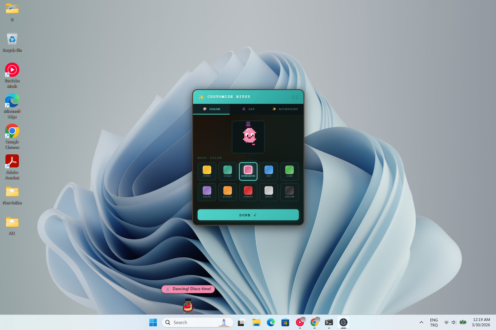

# Dead Pixel Pet

A tiny pixel creature that lives on your desktop and has a life of its own.



## Meet Bitsy

Bitsy is a desktop pet with **50+ unique behaviors**, real emotions, and a personality that reacts to how you treat her. She walks, jumps, climbs walls, shoots machine guns, throws bombs, plants gardens, does magic tricks, and much more.

## Features

- **Real Personality** — 6 mood states (happy, bored, lonely, hyper, grumpy, neutral)
- **Thought Bubbles** — context-aware musings based on mood, time, and your behavior
- **50+ Actions** — machine gun, portal, campfire, parkour, fishing, darts, magic show...
- **Customizable** — 10 colors, 15 hats, 15 accessories
- **Keyboard Aware** — reacts to typing speed, Caps Lock, Enter, Escape
- **Battery Aware** — "I'm getting tired too..." when battery is low
- **Holiday Reactions** — Christmas hat, Halloween horns, Valentine's bow
- **Footprint Trails** — different shapes for walk, sprint, and landing
- **Rare Events** — clone invasion, Pomodoro buddy, screen peeks
- **Transparent Overlay** — click through to your apps, grab and fling Bitsy

## Download

[Download for Windows](https://github.com/user/DeadPixelPet/releases/latest) (72 MB)

## Run from Source

```bash
git clone https://github.com/user/DeadPixelPet.git
cd DeadPixelPet
npm install
npm start
```

## Tech Stack

- Electron 28
- Canvas 2D (programmatic pixel art — no sprites/images)
- Vanilla JavaScript (5900+ lines)
- No game engine, no dependencies beyond Electron

## License

MIT
